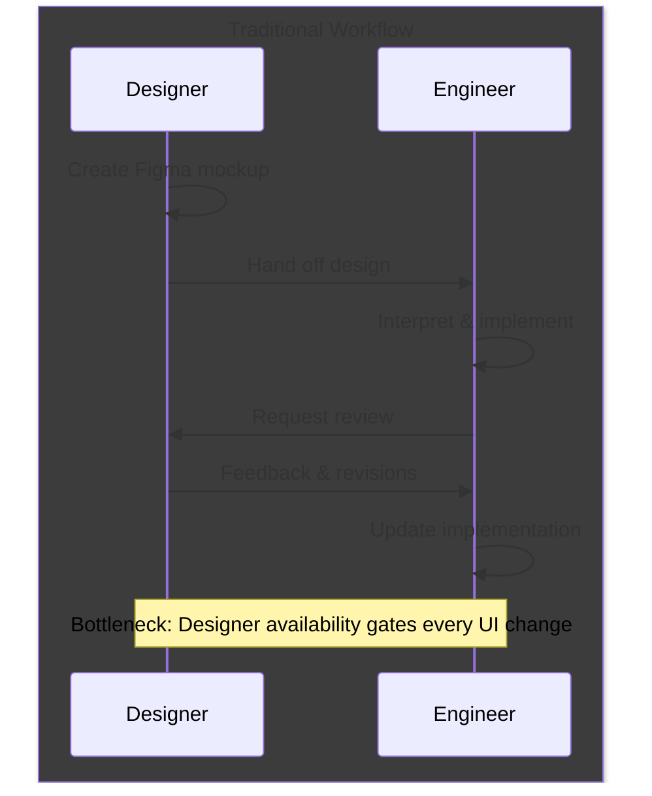
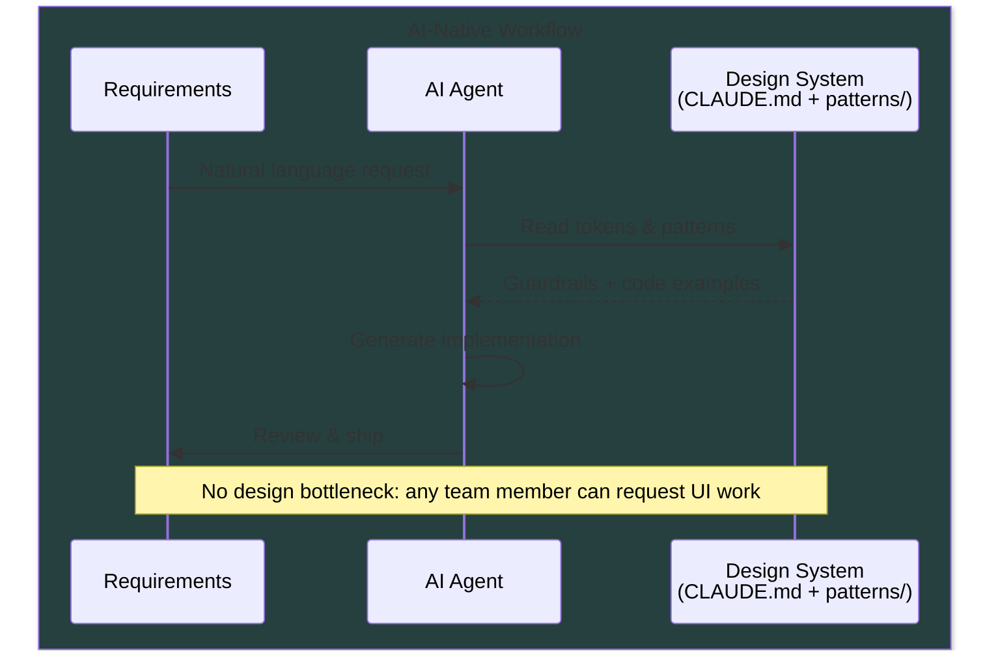
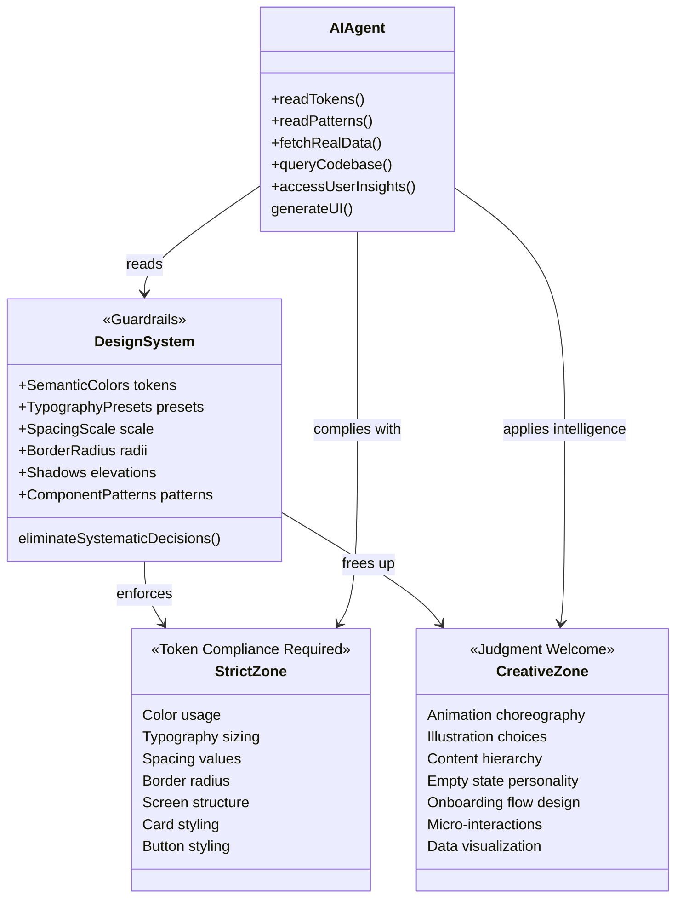
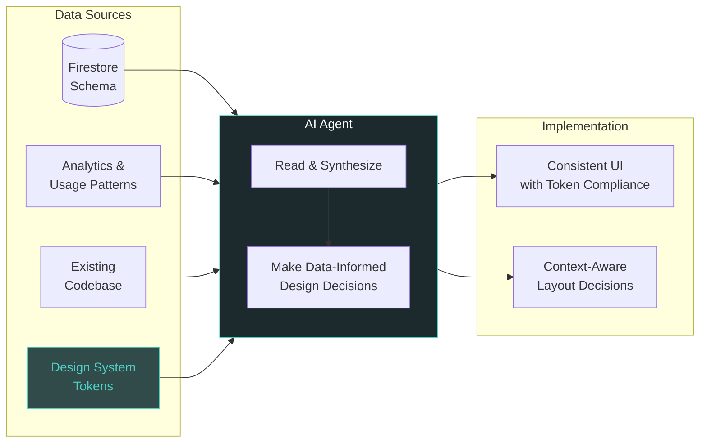
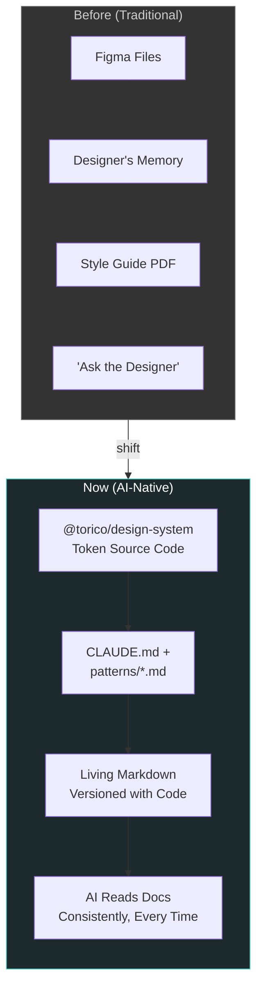
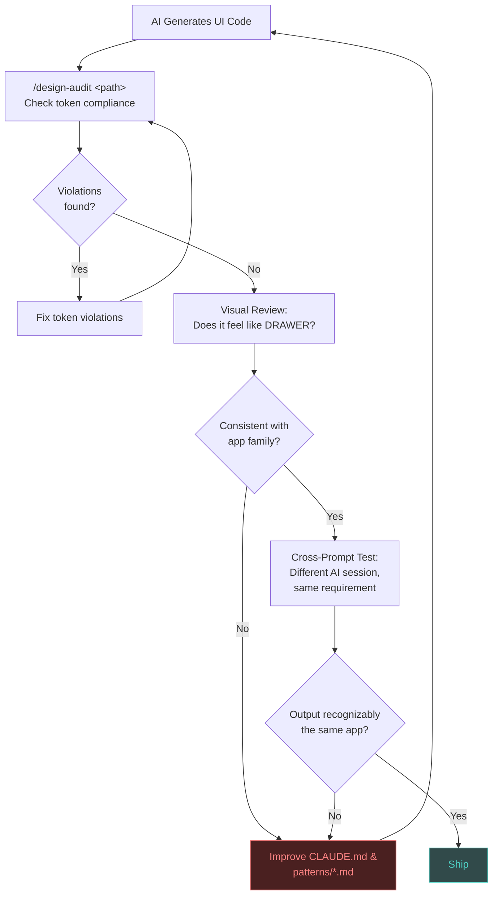
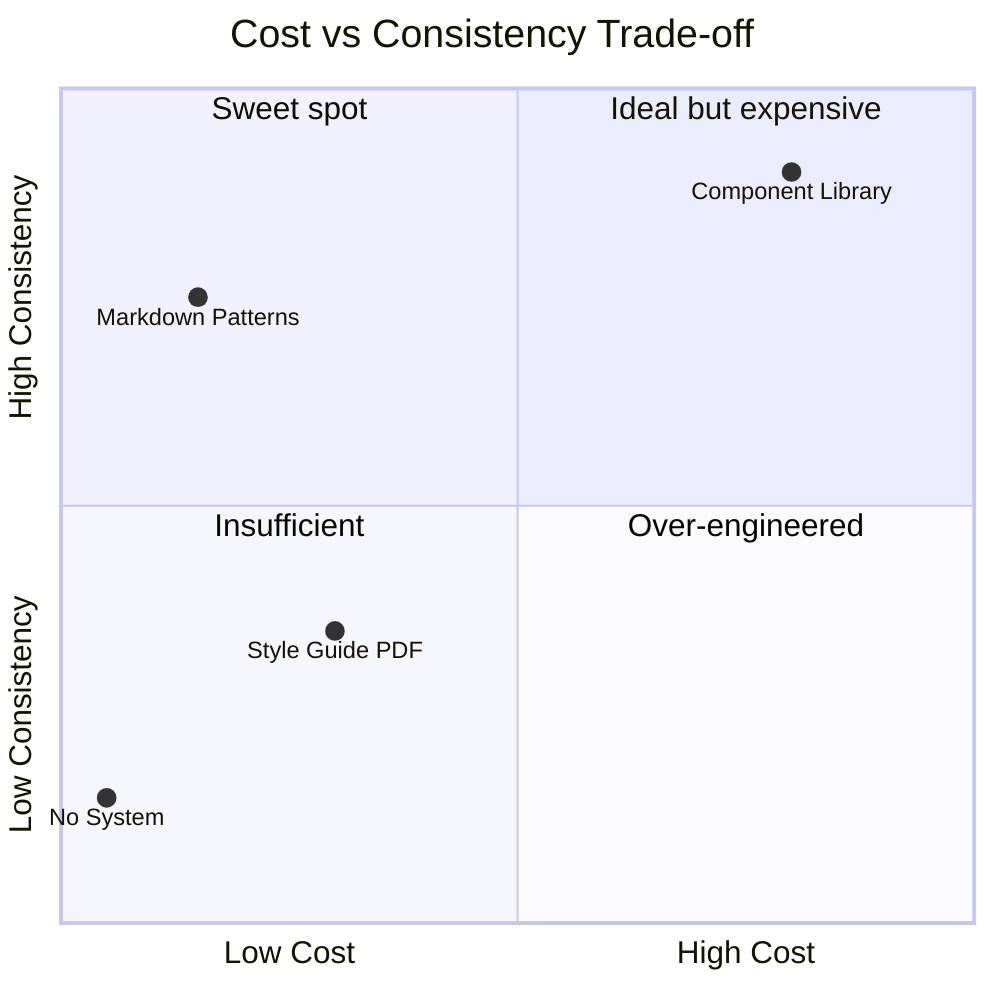

# TORICO Design System

[**View Token Reference**](https://yutonakano.github.io/torico-design-system/)

The single source of truth for all TORICO products (DRAWER, Shunsaku/Instant Output). This design system provides shared design tokens, typography, spacing, and color definitions across React Native and web platforms.

## Why This Design System?

### The Problem We Solved

Before this design system, TORICO products had:

1. **Inconsistent Colors**:
   - `drawer-native` used `#4FD1C5` as the brand teal
   - `drawer-web` used `#4A9B8E` as primary (different shade)
   - 112+ hardcoded color references scattered across drawer-native
   - Mix of rgba and hex formats with no standard

2. **No Unified Tokens**:
   - Typography sizes (32px/20px/16px/14px/12px) hardcoded in StyleSheet.create()
   - Spacing values (4/8/12/16/20/24px) repeated everywhere
   - No centralized way to update design values

3. **Platform Fragmentation**:
   - Native apps and web had separate, duplicated color definitions
   - No shared language between designers and developers
   - Difficult to maintain visual consistency

### What This Design System Provides

- **Single Source of Truth**: All design values defined once, used everywhere
- **Platform Outputs**: Generates React Native, Tailwind, and CSS tokens from the same source
- **Type Safety**: Full TypeScript support with autocompletion
- **Semantic Tokens**: Context-aware colors (e.g., `text.primary` vs raw `#FFFFFF`)
- **Theme Support**: Built-in dark/light theme configurations

## Architecture

```
packages/ui/design-system/
├── tokens/
│   ├── primitives/          # Raw design values
│   │   ├── colors.ts        # Teal palette, neutrals, feedback
│   │   ├── typography.ts    # Font sizes, weights, line heights
│   │   ├── spacing.ts       # 4px base scale (4-128)
│   │   ├── radii.ts         # Border radius scale
│   │   ├── shadows.ts       # Elevation shadows
│   │   └── animations.ts    # Duration, easing
│   ├── semantic/            # Context-aware tokens
│   │   ├── colors.ts        # brand, background, text, border
│   │   └── typography.ts    # Text style presets
│   └── themes/              # Theme configurations
│       ├── light.ts
│       ├── dark.ts
│       └── index.ts
├── build/
│   └── build-tokens.ts      # Generate platform outputs
└── dist/
    ├── native/              # React Native output
    ├── web/                 # Tailwind + CSS output
    └── types/               # TypeScript declarations
```

## Color System

### Unified Brand Colors

| Token | Value | Usage |
|-------|-------|-------|
| `brand.primary` | `#4FD1C5` | Main accent, interactive elements |
| `brand.secondary` | `#1C2A2E` | Dark backgrounds, headers |
| `background.primary` | `#264040` | Main app background (DRAWER iOS style) |
| `background.card` | `rgba(49, 74, 74, 0.95)` | Card backgrounds |
| `text.primary` | `#FFFFFF` | Primary text on dark backgrounds |
| `text.secondary` | `rgba(255, 255, 255, 0.7)` | Secondary/muted text |

### Web Primary Color

The web uses a slightly different primary (`#4A9B8E`) for better contrast on light backgrounds. This is intentional and preserved as `brand.webPrimary`.

## Typography Scale

Based on common sizes found in the codebase:

| Preset | Size | Weight | Line Height | Usage |
|--------|------|--------|-------------|-------|
| `display.large` | 32px | bold | 40px | Hero sections |
| `heading.large` | 20px | bold | 28px | Section headers |
| `body.medium` | 16px | regular | 24px | Main content |
| `body.small` | 14px | regular | 20px | Secondary content |
| `caption.medium` | 12px | regular | 16px | Metadata, timestamps |

## Spacing Scale

4px base spacing system:

```
0: 0, 1: 4px, 2: 8px, 3: 12px, 4: 16px, 5: 20px, 6: 24px, 8: 32px, 12: 48px
```

## Usage

### In drawer-native

The design system is already configured via `tsconfig.json` and `metro.config.js`. Simply import:

```typescript
import {
  background,
  text,
  spacing,
  radii,
  body,
} from '@torico/design-system';

const styles = StyleSheet.create({
  container: {
    backgroundColor: background.primary,
    padding: spacing[4], // 16px
    borderRadius: radii.lg, // 12px
  },
  text: {
    color: text.primary,
    ...body.medium,
  },
});
```

### Tailwind (Web)

```typescript
// tailwind.config.ts
import { toricoTokens } from '@torico/design-system/tailwind';

export default {
  theme: {
    extend: {
      colors: toricoTokens.colors,
      spacing: toricoTokens.spacing,
      borderRadius: toricoTokens.borderRadius,
    },
  },
};
```

### CSS Custom Properties

```css
@import '@torico/design-system/dist/web/tokens.css';

.card {
  background-color: var(--color-app-background);
  padding: var(--spacing-4);
  border-radius: var(--radius-lg);
}
```

## Building

```bash
cd packages/ui/design-system
npm install
npm run build:tokens
```

This generates:
- `dist/native/` - React Native compatible exports
- `dist/web/tailwind.tokens.js` - Tailwind configuration
- `dist/web/tokens.css` - CSS custom properties
- `dist/types/` - TypeScript declarations

## Migration Guide

### From hardcoded colors

```typescript
// Before
const styles = StyleSheet.create({
  container: {
    backgroundColor: '#264040',
    color: '#4FD1C5',
  },
});

// After
import { background, text } from '@torico/design-system/tokens';

const styles = StyleSheet.create({
  container: {
    backgroundColor: background.primary,
    color: text.brand,
  },
});
```

### From Colors.ts constants

```typescript
// Before
import Colors from '@/constants/Colors';
color: Colors.drawerGreenText

// After
import { brand } from '@torico/design-system/tokens';
color: brand.primary
```

## Design Decisions

### Why Dark Mode First?

DRAWER and Shunsaku apps are primarily dark-mode applications. The semantic tokens default to dark mode values, with light theme available as an override for web landing pages.

### Why Keep Web Primary Different?

The web uses `#4A9B8E` instead of `#4FD1C5` because:
1. Better contrast ratios on white backgrounds
2. Existing brand recognition on drawer-web landing pages
3. Print/accessibility considerations for web contexts

### Why 4px Base Spacing?

- Matches iOS Human Interface Guidelines
- Works well with 8pt grid systems
- Commonly found pattern in existing codebase

## Pattern Catalog

The `patterns/` directory contains reusable UI patterns with token-only code examples. These serve as AI-readable design documentation — the AI-era equivalent of Storybook.

| Pattern | File |
|---------|------|
| Screen Layouts | [patterns/screen-layouts.md](patterns/screen-layouts.md) |
| Cards | [patterns/cards.md](patterns/cards.md) |
| Lists | [patterns/lists.md](patterns/lists.md) |
| Buttons | [patterns/buttons.md](patterns/buttons.md) |
| Forms | [patterns/forms.md](patterns/forms.md) |
| Feedback | [patterns/feedback.md](patterns/feedback.md) |
| Navigation | [patterns/navigation.md](patterns/navigation.md) |

See `CLAUDE.md` for the complete AI agent guide including token reference, decision rules, and anti-patterns.

## AI-Native Design Philosophy

See [discussions/ai-native-design-philosophy.md](discussions/ai-native-design-philosophy.md) for the full rationale behind this documentation-as-guardrails approach.

### Workflow Shift: Traditional vs AI-Native





### System Architecture: Guardrails vs Creative Freedom



### AI as Data-Informed Designer



### Source of Truth Evolution



### Verification Loop



### Why Documentation Patterns over Component Library



## Future Plans

- [ ] Visual regression testing
- [ ] CLI tool for migration assistance

## Contributing

When adding new tokens:
1. Add primitive values in `tokens/primitives/`
2. Create semantic mappings in `tokens/semantic/`
3. Update themes if needed in `tokens/themes/`
4. Re-export from `tokens/index.ts`
5. Update build script if adding new categories
6. Update this README

## License

MIT - Internal TORICO use
