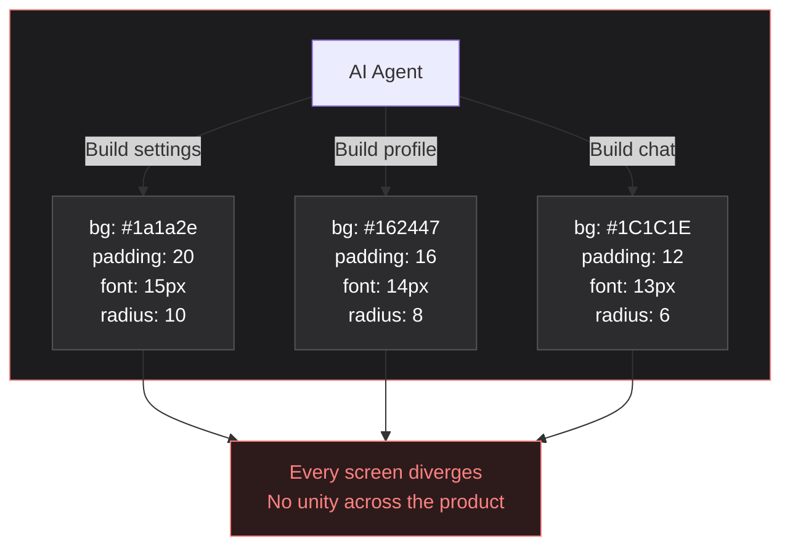
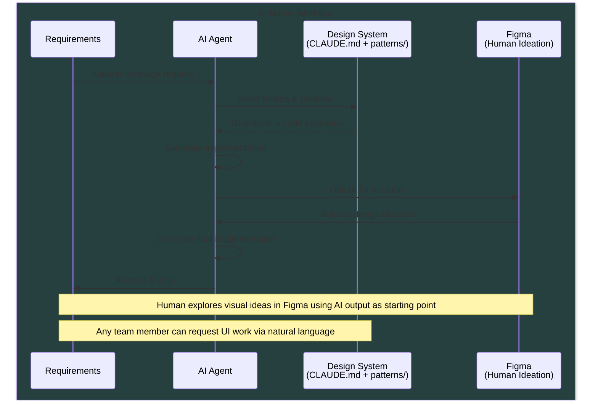
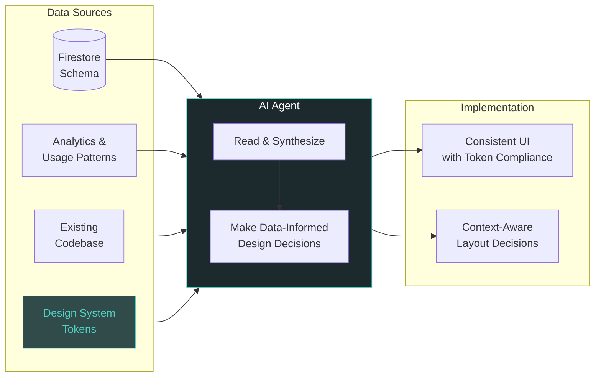

# TORICO Design System

[**View Token Reference**](https://yutonakano.github.io/torico-design-system/)

The single source of truth for all TORICO products (DRAWER, Shunsaku/Instant Output). This design system provides shared design tokens, typography, spacing, and color definitions across React Native and web platforms.

## Why This Design System?

### The Problem: AI Without Guardrails

Without a design system, every AI-generated screen picks its own values. Over dozens of requests, the product loses all visual consistency.



Before this design system, TORICO products had:

1. **Inconsistent Design Values**: Colors, typography, spacing, and other design values were hardcoded throughout the codebase with no standard format or central definition
2. **No Single Source of Truth**: The same values were duplicated and diverged across components, making it impossible to evolve the design cohesively
3. **Platform Fragmentation**: Native apps and web maintained separate, duplicated definitions — changes had to be made in multiple places and inevitably drifted apart

### What This Design System Provides

- **Neutral-First Design**: UI chrome uses neutral colors; brand personality comes from character illustrations and teal accents — not from painting every surface teal
- **Single Source of Truth**: All design values defined once, consumed by React Native, Tailwind, and CSS
- **AI-Native Workflow**: `CLAUDE.md` + `patterns/` provide guardrails so any team member can request UI work via natural language and get token-compliant output
- **Type Safety**: Full TypeScript support with autocompletion
- **Semantic Tokens**: Context-aware colors (e.g., `text.primary` vs raw `#FFFFFF`)
- **Character Assets**: Shared character illustrations exported for all platforms via `@torico/design-system/assets`

## Design Process

See [discussions/ai-native-design-philosophy.md](discussions/ai-native-design-philosophy.md) for the full rationale behind this documentation-as-guardrails approach.



### AI as Data-Informed Designer



## Architecture

```
├── tokens/
│   ├── primitives/          # Raw design values
│   │   ├── colors.ts        # Neutral palette, teal accents, feedback
│   │   ├── typography.ts    # Font sizes, weights, line heights
│   │   ├── spacing.ts       # 4px base scale (0-160)
│   │   ├── radii.ts         # Border radius scale
│   │   ├── shadows.ts       # Elevation shadows
│   │   └── animations.ts    # Duration, easing
│   ├── semantic/            # Context-aware tokens
│   │   ├── colors.ts        # background, text, interactive, drawerGreen
│   │   └── typography.ts    # Text style presets (display–code)
│   └── themes/              # Theme configurations
│       ├── light.ts
│       ├── dark.ts
│       └── index.ts
├── assets/                  # Character illustrations
├── patterns/                # AI-readable UI pattern docs
├── build/
│   └── build-tokens.ts      # Generate platform outputs
└── dist/
    ├── native/              # React Native output
    ├── web/                 # Tailwind + CSS output
    ├── types/               # TypeScript declarations
    └── reference.html       # Visual token reference page
```

## Color System

The design system uses a **neutral-first** palette — clean blacks, whites, and grays for UI chrome. Brand personality comes from character assets and selective teal accents via `drawerGreen`.

### Semantic Colors

| Token | Value | Usage |
|-------|-------|-------|
| `background.primary` | `#000000` | Main app background |
| `background.secondary` | `#1C1C1E` | Sheets, modals, grouped sections |
| `background.tertiary` | `#2C2C2E` | Elevated cards |
| `background.card` | `rgba(26, 26, 26, 0.95)` | Card backgrounds |
| `background.surface` | `#252525` | Inputs, pickers |
| `text.primary` | `#FFFFFF` | Primary text |
| `text.secondary` | `rgba(255, 255, 255, 0.6)` | Supporting text |
| `text.tertiary` | `rgba(255, 255, 255, 0.4)` | Hints, metadata |
| `interactive.primary` | `#FFFFFF` | Buttons, active states |
| `interactive.destructive` | `#EF4444` | Delete, remove |
| `border.default` | `#282828` | Standard borders |
| `border.subtle` | `rgba(255, 255, 255, 0.1)` | Dividers |
| `drawerGreen.primary` | `#4FD1C5` | DRAWER brand accent |
| `drawerGreen.text` | `#4FD1C5` | Teal accent text |

## Typography Scale

| Preset | Size | Weight | Line Height | Usage |
|--------|------|--------|-------------|-------|
| `display.large` | 32px | bold | 40px | Screen titles, hero text |
| `display.medium` | 28px | bold | 36px | Large feature headings |
| `display.small` | 24px | bold | 32px | Modal titles |
| `heading.large` | 20px | bold | 28px | Section headings |
| `heading.medium` | 18px | semibold | 28px | Subsection headings |
| `heading.small` | 16px | semibold | 24px | Card titles |
| `body.large` | 18px | regular | 28px | Emphasized body text |
| `body.medium` | 16px | regular | 24px | Standard body text |
| `body.small` | 14px | regular | 20px | Secondary content |
| `label.large` | 16px | medium | 24px | Form labels |
| `label.medium` | 14px | medium | 20px | Button labels, tags |
| `label.small` | 12px | medium | 16px | Section headers (uppercase) |
| `caption.medium` | 12px | regular | 16px | Metadata, timestamps |
| `caption.small` | 10px | regular | 14px | Micro text, badges |
| `button.large` | 18px | semibold | 28px | Large button text |
| `button.medium` | 16px | semibold | 24px | Standard button text |
| `button.small` | 14px | semibold | 20px | Compact button text |
| `code.large` | 16px | regular | 24px | Code blocks |
| `code.medium` | 14px | regular | 20px | Inline code |
| `code.small` | 12px | regular | 16px | Small code snippets |

## Spacing Scale

4px base system with 25+ values. Core values:

```
0: 0     1: 4px    2: 8px    3: 12px   4: 16px   5: 20px
6: 24px  7: 28px   8: 32px   9: 36px  10: 40px  12: 48px
14: 56px 16: 64px  20: 80px  24: 96px  32: 128px
```

Half-step values also available: `0.5` (2px), `1.5` (6px), `2.5` (10px), `3.5` (14px), plus `px` (1px).

**Component aliases** (prefer these for standard layouts):
- `componentSpacing.screenPaddingX` → 16px
- `componentSpacing.screenPaddingY` → 24px
- `componentSpacing.cardPadding` → 16px
- `componentSpacing.sectionGap` → 24px
- `componentSpacing.listItemGap` → 12px

## Usage

### In drawer-native

The design system is already configured via `tsconfig.json` and `metro.config.js`. Simply import:

```typescript
import {
  background, text, interactive, drawerGreen,
  spacing, radii, body, heading,
} from '@torico/design-system';

const styles = StyleSheet.create({
  container: {
    backgroundColor: background.primary,
    padding: spacing[4], // 16px
    borderRadius: radii.lg, // 12px
  },
  title: {
    color: text.primary,
    ...heading.large,
  },
  body: {
    color: text.secondary,
    ...body.medium,
  },
  accent: {
    color: drawerGreen.text,
  },
});
```

### Tailwind (Web)

```typescript
// tailwind.config.ts
import { toricoTokens } from '@torico/design-system/tailwind';

export default {
  theme: {
    extend: {
      colors: toricoTokens.colors,
      spacing: toricoTokens.spacing,
      borderRadius: toricoTokens.borderRadius,
    },
  },
};
```

### CSS Custom Properties

```css
@import '@torico/design-system/dist/web/tokens.css';

.card {
  background-color: var(--color-app-background);
  padding: var(--spacing-4);
  border-radius: var(--radius-lg);
}
```

## Building

```bash
npm install
npm run build:tokens
```

This generates:
- `dist/native/` - React Native compatible exports
- `dist/web/tailwind.tokens.js` - Tailwind configuration
- `dist/web/tokens.css` - CSS custom properties
- `dist/types/` - TypeScript declarations
- `dist/reference.html` - Visual token reference page ([view online](https://yutonakano.github.io/torico-design-system/))

## Migration Guide

### From hardcoded colors

```typescript
// Before
const styles = StyleSheet.create({
  container: {
    backgroundColor: '#000000',
    color: '#4FD1C5',
  },
});

// After
import { background, drawerGreen } from '@torico/design-system/tokens';

const styles = StyleSheet.create({
  container: {
    backgroundColor: background.primary,
    color: drawerGreen.text,
  },
});
```

### From Colors.ts constants

```typescript
// Before
import Colors from '@/constants/Colors';
color: Colors.drawerGreenText

// After
import { drawerGreen } from '@torico/design-system/tokens';
color: drawerGreen.text
```

## Design Decisions

### Why Neutral-First?

Earlier iterations painted UI surfaces with teal tints (`#264040`, `rgba(49,74,74,…)`). The current system uses clean neutrals (#000, #1C1C1E, #2C2C2E) for UI chrome and reserves teal (`drawerGreen`) for selective accents. Brand personality comes from character illustrations, not from coloring every surface.

### Why Dark Mode First?

DRAWER and Shunsaku apps are primarily dark-mode applications. The semantic tokens default to dark mode values, with light theme available as an override for web landing pages and coach dashboard.

### Why 4px Base Spacing?

- Matches iOS Human Interface Guidelines
- Works well with 8pt grid systems
- Commonly found pattern in existing codebase

## Pattern Catalog

The `patterns/` directory contains reusable UI patterns with token-only code examples. These serve as AI-readable design documentation — the AI-era equivalent of Storybook.

| Pattern | File |
|---------|------|
| Design Direction | [patterns/design-direction.md](patterns/design-direction.md) |
| Principles | [patterns/principles.md](patterns/principles.md) |
| Screen Layouts | [patterns/screen-layouts.md](patterns/screen-layouts.md) |
| Cards | [patterns/cards.md](patterns/cards.md) |
| Lists | [patterns/lists.md](patterns/lists.md) |
| Buttons | [patterns/buttons.md](patterns/buttons.md) |
| Forms | [patterns/forms.md](patterns/forms.md) |
| Feedback | [patterns/feedback.md](patterns/feedback.md) |
| Navigation | [patterns/navigation.md](patterns/navigation.md) |

See `CLAUDE.md` for the complete AI agent guide including token reference, decision rules, and anti-patterns.

## Future Plans

- [ ] Visual regression testing
- [ ] CLI tool for migration assistance

## Contributing

When adding new tokens:
1. Add primitive values in `tokens/primitives/`
2. Create semantic mappings in `tokens/semantic/`
3. Update themes if needed in `tokens/themes/`
4. Re-export from `tokens/index.ts`
5. Update build script if adding new categories
6. Update this README

## License

MIT - Internal TORICO use
