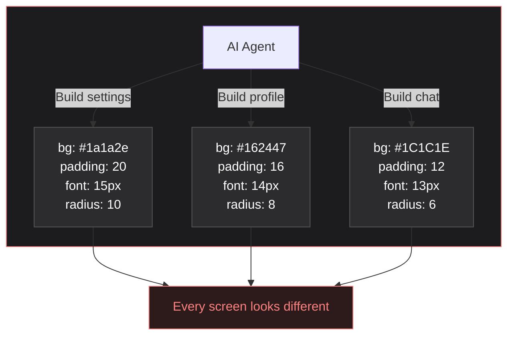
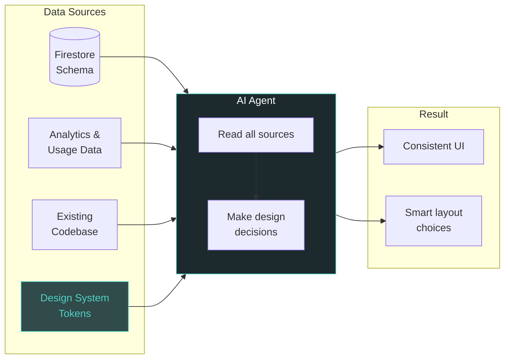

# TORICO Design System

[**View Token Reference**](https://yutonakano.github.io/torico-design-system/) | [**AI Agent Guide (CLAUDE.md)**](CLAUDE.md)

One place for all design values (colors, fonts, spacing, shapes) used by DRAWER and Shunsaku apps. Works with React Native and web.

## Why?

Without shared rules, AI agents pick different values each time. Screens stop looking like they belong together.



Before this design system, TORICO products had:

1. **Hardcoded values everywhere** — colors, fonts, and spacing were written directly in code with no shared format
2. **No single source** — the same values were copied across components and slowly drifted apart
3. **Platform split** — React Native and web each had their own copies, so changes had to be made in multiple places

### What This Gives You

- **Neutral-first colors** — clean blacks and grays for UI; brand personality comes from character art and teal accents
- **One source for all platforms** — define values once, use in React Native, Tailwind, and CSS
- **AI-ready workflow** — `CLAUDE.md` + `patterns/` guide AI agents so anyone can request UI work in plain language and get consistent output
- **Type safety** — full TypeScript support with autocomplete
- **Named tokens** — use `text.primary` instead of raw `#FFFFFF`
- **Shared character art** — illustrations exported for all platforms via `@torico/design-system/assets`

## How It Works




## Folder Structure

```
├── tokens/
│   ├── primitives/          # Base values (colors, sizes, spacing)
│   │   ├── colors.ts        # Neutral palette, teal accents, feedback
│   │   ├── typography.ts    # Font sizes, weights, line heights
│   │   ├── spacing.ts       # 4px base scale
│   │   ├── radii.ts         # Border radius scale
│   │   ├── shadows.ts       # Elevation shadows
│   │   └── animations.ts    # Duration, easing
│   ├── semantic/            # Named tokens (e.g. text.primary)
│   │   ├── colors.ts        # background, text, interactive, drawerGreen
│   │   └── typography.ts    # Text style presets (display–code)
│   └── themes/              # Light / dark
│       ├── light.ts
│       ├── dark.ts
│       └── index.ts
├── assets/                  # Character images
├── patterns/                # UI pattern docs for AI
├── build/
│   └── build-tokens.ts      # Build script
└── dist/
    ├── native/              # React Native output
    ├── web/                 # Tailwind + CSS output
    ├── types/               # TypeScript types
    └── reference.html       # Visual reference page
```

## Usage

### React Native

```typescript
import {
  background, text, interactive, drawerGreen,
  spacing, radii, body, heading,
} from '@torico/design-system';

const styles = StyleSheet.create({
  container: {
    backgroundColor: background.primary,
    padding: spacing[4],
    borderRadius: radii.lg,
  },
  title: { color: text.primary, ...heading.large },
  body: { color: text.secondary, ...body.medium },
});
```

### Tailwind (Web)

```typescript
import { toricoTokens } from '@torico/design-system/tailwind';

export default {
  theme: {
    extend: {
      colors: toricoTokens.colors,
      spacing: toricoTokens.spacing,
      borderRadius: toricoTokens.borderRadius,
    },
  },
};
```

### CSS Custom Properties

```css
@import '@torico/design-system/dist/web/tokens.css';

.card {
  background-color: var(--color-app-background);
  padding: var(--spacing-4);
  border-radius: var(--radius-lg);
}
```

## Building

```bash
npm install
npm run build:tokens
```

This creates:
- `dist/native/` — React Native exports
- `dist/web/tailwind.tokens.js` — Tailwind config
- `dist/web/tokens.css` — CSS custom properties
- `dist/types/` — TypeScript types
- `dist/reference.html` — visual reference page ([view online](https://yutonakano.github.io/torico-design-system/))

## Design Decisions

**Why neutral colors?** Earlier versions used teal on every surface. Now we use clean neutrals (#000, #1C1C1E, #2C2C2E) for UI and save teal (`drawerGreen`) for accents. Brand personality comes from character art, not background colors.

**Why dark mode first?** DRAWER and Shunsaku are dark-mode apps. Tokens default to dark values. Light theme is available for web pages and the coach dashboard.

**Why 4px spacing?** It matches iOS guidelines, works well with 8pt grids, and fits the patterns already in the codebase.

## Patterns

The `patterns/` folder has reusable UI patterns with code examples that only use tokens. Think of it as design docs that AI agents can read.

| Pattern | File |
|---------|------|
| Design Direction | [patterns/design-direction.md](patterns/design-direction.md) |
| Principles | [patterns/principles.md](patterns/principles.md) |
| Screen Layouts | [patterns/screen-layouts.md](patterns/screen-layouts.md) |
| Cards | [patterns/cards.md](patterns/cards.md) |
| Lists | [patterns/lists.md](patterns/lists.md) |
| Buttons | [patterns/buttons.md](patterns/buttons.md) |
| Forms | [patterns/forms.md](patterns/forms.md) |
| Feedback | [patterns/feedback.md](patterns/feedback.md) |
| Navigation | [patterns/navigation.md](patterns/navigation.md) |

See `CLAUDE.md` for the full AI agent guide with token tables, decision rules, and anti-patterns.

## Contributing

1. Add base values in `tokens/primitives/`
2. Add named tokens in `tokens/semantic/`
3. Update themes in `tokens/themes/` if needed
4. Re-export from `tokens/index.ts`
5. Update build script if you added a new category
6. Update this README

## License

MIT - Internal TORICO use
