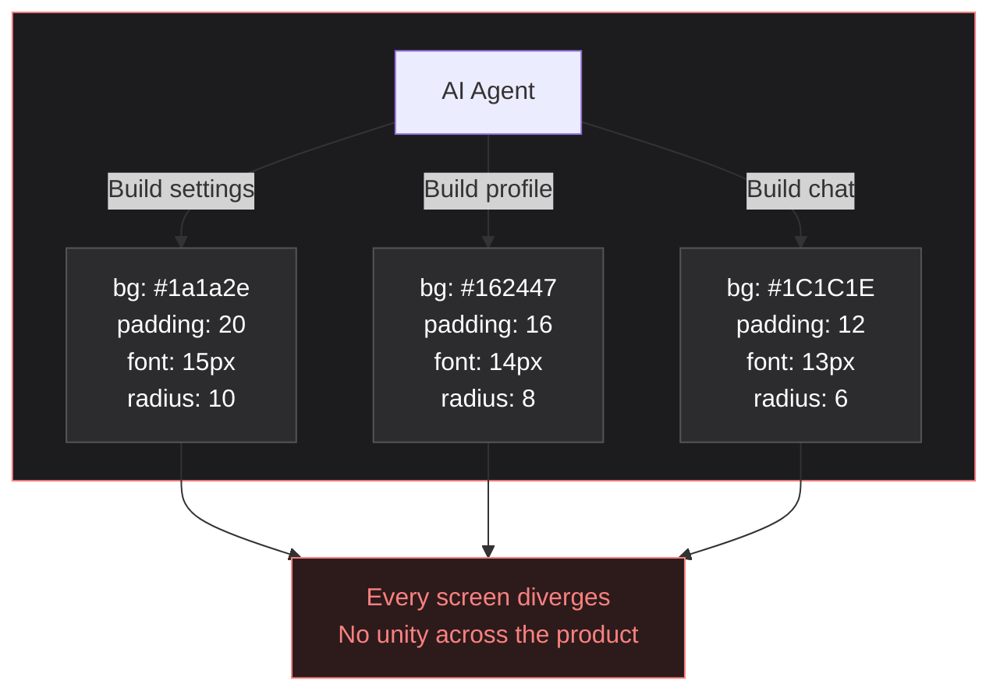
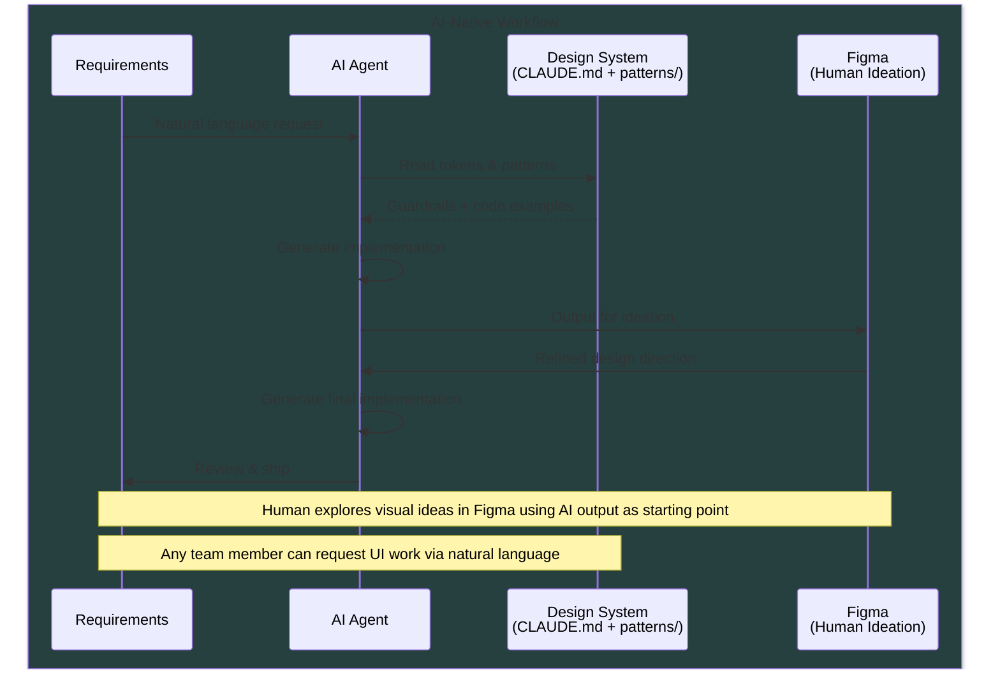
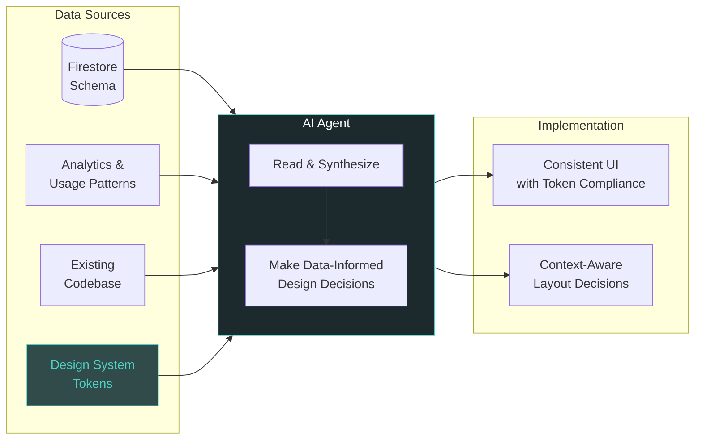

# TORICO Design System

[**View Token Reference**](https://yutonakano.github.io/torico-design-system/) | [**AI Agent Guide (CLAUDE.md)**](CLAUDE.md)

Single source of truth for all TORICO products (DRAWER, Shunsaku). Tokens for colors, typography, spacing, and shape across React Native and web.

## Why This Design System?



`CLAUDE.md` + `patterns/` give AI agents guardrails so every generated screen uses the same tokens — consistent UI without manual review.

## Design Process





## Architecture

```
├── tokens/
│   ├── primitives/          # Raw design values
│   ├── semantic/            # Context-aware tokens
│   └── themes/              # Light / dark
├── assets/                  # Character illustrations
├── patterns/                # AI-readable UI pattern docs
├── build/
│   └── build-tokens.ts      # Generate platform outputs
└── dist/
    ├── native/              # React Native output
    ├── web/                 # Tailwind + CSS output
    ├── types/               # TypeScript declarations
    └── reference.html       # Visual token reference page
```

## Usage

### React Native

```typescript
import {
  background, text, interactive, drawerGreen,
  spacing, radii, body, heading,
} from '@torico/design-system';

const styles = StyleSheet.create({
  container: {
    backgroundColor: background.primary,
    padding: spacing[4],
    borderRadius: radii.lg,
  },
  title: { color: text.primary, ...heading.large },
  body: { color: text.secondary, ...body.medium },
});
```

### Tailwind (Web)

```typescript
import { toricoTokens } from '@torico/design-system/tailwind';

export default {
  theme: {
    extend: {
      colors: toricoTokens.colors,
      spacing: toricoTokens.spacing,
      borderRadius: toricoTokens.borderRadius,
    },
  },
};
```

### CSS Custom Properties

```css
@import '@torico/design-system/dist/web/tokens.css';

.card {
  background-color: var(--color-app-background);
  padding: var(--spacing-4);
  border-radius: var(--radius-lg);
}
```

## Building

```bash
npm install
npm run build:tokens
```

## Pattern Catalog

| Pattern | File |
|---------|------|
| Design Direction | [patterns/design-direction.md](patterns/design-direction.md) |
| Principles | [patterns/principles.md](patterns/principles.md) |
| Screen Layouts | [patterns/screen-layouts.md](patterns/screen-layouts.md) |
| Cards | [patterns/cards.md](patterns/cards.md) |
| Lists | [patterns/lists.md](patterns/lists.md) |
| Buttons | [patterns/buttons.md](patterns/buttons.md) |
| Forms | [patterns/forms.md](patterns/forms.md) |
| Feedback | [patterns/feedback.md](patterns/feedback.md) |
| Navigation | [patterns/navigation.md](patterns/navigation.md) |

## License

MIT - Internal TORICO use
